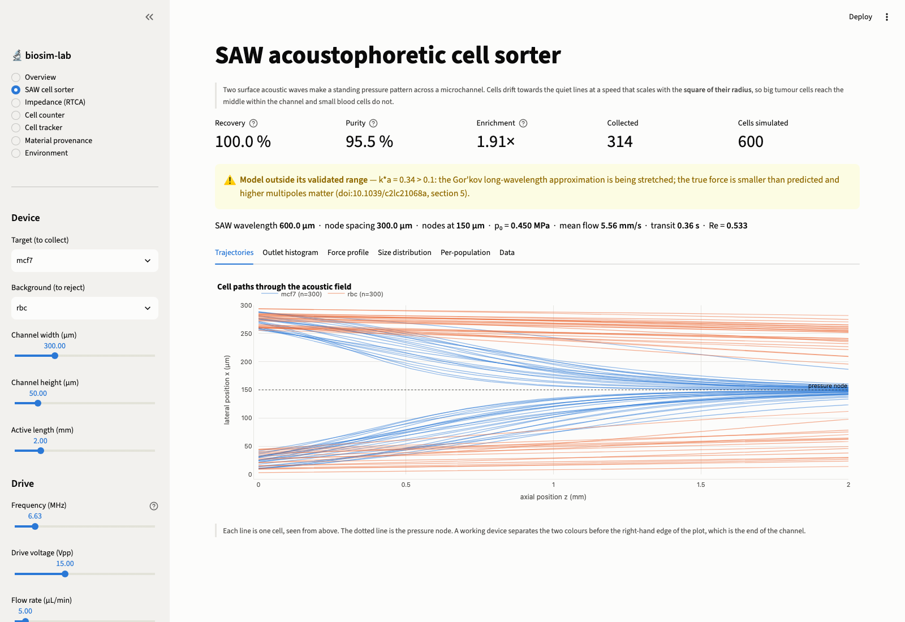
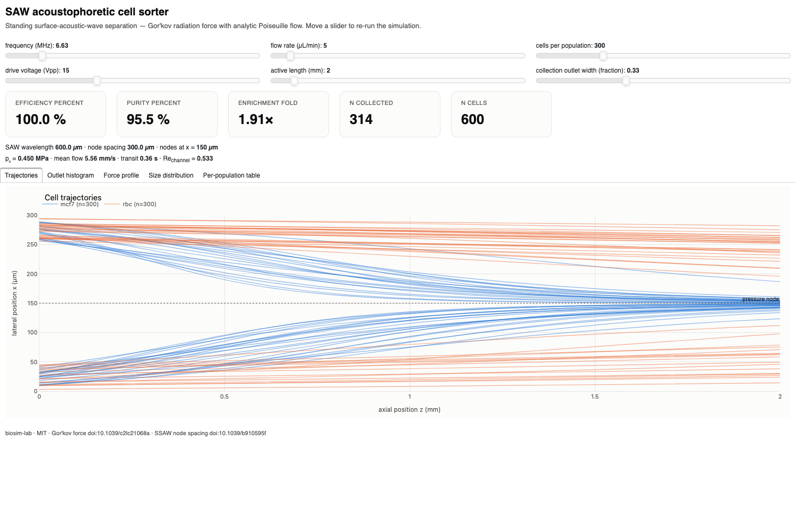

# biosim-lab

**Açık kaynak, eklenti mimarili sanal laboratuvar cihazı platformu**
**Open-source, plugin-based virtual laboratory instrument platform**

[](LICENSE)
[](pyproject.toml)

Ticari cihazların (xCELLigence RTCA, akustik hücre ayırıcılar, otomatik hücre
sayıcılar, canlı hücre takip sistemleri) yaptığı analizleri **tamamen açık
kaynak** araçlarla simüle eder ve gerçek cihaz verisiyle de çalışır.

Simulates what commercial bio-instruments do — impedance-based real-time cell
analysis, acoustic cell sorting, automated counting, live-cell tracking — using
**only** free and open-source Python tooling, and runs the same analyses on
measured instrument data.

> Ticari yazılım kullanılmaz: COMSOL, ANSYS ve MATLAB yoktur. Yığın NumPy,
> SciPy, xarray, pint, pydantic, Gmsh, scikit-fem, PyVista, Plotly + Panel,
> scikit-image ve trackpy'dir. Ağır çözücüler (OpenFOAM, Elmer) yalnızca
> **opsiyonel** eklentidir; çekirdek onlarsız eksiksiz çalışır.

---

## İçindekiler / Contents

- [Kurulum / Installation](#kurulum--installation)
- [Hızlı başlangıç / Quick start](#hızlı-başlangıç--quick-start)
- [Cihazlar / Instruments](#cihazlar--instruments)
- [Fizik / Physics](#fizik--physics)
- [Bilmeniz gereken dört sonuç / Four findings you should know](#bilmeniz-gereken-dört-sonuç--four-findings-you-should-know)
- [Örnekler / Examples](#örnekler--examples)
- [Komut satırı / CLI](#komut-satırı--cli)
- [Docker](#docker)
- [Kaynaklar ve varsayımlar / Provenance and assumptions](#kaynaklar-ve-varsayımlar--provenance-and-assumptions)
- [Katkı / Contributing](#katkı--contributing)

---

## Kurulum / Installation

Python ≥ 3.11 gerekir.

```bash
git clone https://github.com/biosim-lab/biosim-lab.git
cd biosim-lab
python -m venv .venv && source .venv/bin/activate   # Windows: .venv\Scripts\activate
pip install -e ".[mesh]"   # veya sadece: pip install -e .
biosim doctor              # neyin kurulu olduğunu raporlar / reports what works
```

İsteğe bağlı ekler / optional extras:

| Ek / extra | Ne sağlar / what it adds |
|---|---|
| `pip install -e ".[mesh]"` | Gmsh + meshio: PDMS duvarlı ağlar (düz kanal bunlarsız da çalışır) |
| `pip install -e ".[imaging]"` | Napari görüntüleyici, `btrack` soy ağacı |
| `pip install -e ".[segmentation]"` | Cellpose / StarDist segmentasyon arka uçları |
| `pip install -e ".[movie]"` | MP4 yörünge animasyonu (`imageio-ffmpeg`) |
| `pip install -e ".[dev]"` | pytest, ruff, mypy |

**Ağır çözücüler ayrı imajlardadır** (`biosim-lab-openfoam`, `biosim-lab-elmer`)
ve ana imaja bağımlılık eklemezler. Kurulu değillerse platform şunu bildirir:

> *streaming devre dışı, analitik Rayleigh yaklaşımı kullanılıyor*

---

## Tarayıcıda dene / Try it in a browser

```bash
pip install -r requirements.txt
streamlit run streamlit_app.py             # http://localhost:8501
```

Aynı dosya Streamlit Community Cloud'a olduğu gibi dağıtılabilir — depoyu
GitHub'a itin, giriş noktası olarak `streamlit_app.py` seçin. Adım adım anlatım:
[USER\_MANUAL.md §9](docs/USER_MANUAL.md#9-publishing-your-own-copy-on-streamlit).

`requirements.txt` yönetilen bir sunucuda **gerçekten çalışan her şeyi** içerir.
Depoda bilerek **`packages.txt` yoktur**: böyle bir dosyanın varlığı sunucuda
`apt-get update` çalıştırır ve temel imajdaki süresi dolmuş tek bir depo tüm
dağıtımı düşürür — üstelik yeni örnek hiç başlamadığı için eski süreç eski kodla
hizmet vermeye devam eder. Hiçbir bağımlılık sistem kütüphanesi gerektirmez;
OpenGL olmadan içe aktarılamayan tek paket Gmsh'tir ve yapılandırılmış ağ
şablonuna geri düşer. Bu küme, Streamlit Cloud'un çalıştırdığı platformun aynısı
olan `linux/amd64` konteynerinde **hiç apt paketi kurulmadan** doğrulanmıştır.

Üçü bilerek dışarıdadır ve `requirements.txt`'e eklemek işe yaramaz: **Napari**
(Qt ve ekran ister), **OpenFOAM/Elmer** (Python paketi değil, harici ikili
dosya), **Cellpose/StarDist** (varsayılan PyTorch tekerleği ~2.5 GB CUDA taşır;
CPU sürümü için `requirements.txt` sonundaki dört satırı açın). Uygulamanın
*Environment* sayfası bunları *kurulu*, *eksik ama eklenebilir* ve *burada
çalışamaz* diye ayırarak canlı raporlar.



Panoda **canlı görünüm** sekmesi hücreleri tek tek, gerçek yarıçaplarıyla,
kanal boyunca hareket ederken gösterir (oynat düğmesi ve zaman kaydırıcısı ile);
ölü hücreler içi boş gri işaretlerdir. **Kesit** sekmesi kanalı ölçekli keser,
**canlı sayım** çıkışta biriken sayacı, **hücre güvenliği** ise üç hasar
mekanizmasının yayımlanmış eşiklere olan marjını verir.

## Hızlı başlangıç / Quick start

```bash
biosim list                                # kurulu cihaz ve çözücüler
biosim init saw_sorter -o my_run.yaml      # çalışır bir yapılandırma yaz
biosim run my_run.yaml                     # çalıştır, results/ altına yaz
biosim dashboard my_run.yaml               # tarayıcıda etkileşimli pano
```

Python'dan / from Python:

```python
from biosim_lab.core.config import ExperimentConfig
from biosim_lab.core.plugin import get_instrument

cfg = ExperimentConfig.from_yaml("configs/ctc_vs_rbc.yaml")
instrument = get_instrument(cfg.instrument)(cfg)
result = instrument.run()

print(result.metrics["efficiency_percent"], result.metrics["purity_percent"])
result.table.head()          # hücre başına bir satır / one row per cell
instrument.dashboard()       # Panel görünümü / Panel view
```

Birimler yapılandırmada açıkça yazılır ve `pint` ile denetlenir; çekirdeğe
yalnızca SI `float` geçer:

```yaml
params:
  frequency: 6.632 MHz     # "20 um" yazsanız DimensionalityError alırsınız
  channel_width: 300 um
  flow_rate: 5 uL/min
```

---

## Cihazlar / Instruments

| Eklenti | Ticari karşılığı | Durum | Ne yapar |
|---|---|---|---|
| `saw_sorter` | Akustik hücre ayırıcı | **Tam** | Duran yüzey akustik dalgası ile CTC/kan hücresi ayrımı: Gor'kov kuvveti, analitik + FEM, metrikler, parametre taraması, canlı pano |
| `impedance_rtca` | xCELLigence RTCA | **Minimal çalışır** | Giaever–Keese elektrot modeli, Cell Index eğrisi, \|Z\|(f) spektrumu, 4PL IC50 |
| `cell_counter` | Countess / Cellometer | **İskelet + demo** | Watershed segmentasyon, Neubauer geometrisiyle konsantrasyon, tripan mavisi canlılık |
| `cell_tracker` | Incucyte / CellTracker | **İskelet + demo** | trackpy bağlama, hız / persistans / MSD |

Çözücü arka uçları / solver back-ends:

| Çözücü | Tür | Durum |
|---|---|---|
| `builtin_helmholtz` | akustik | **Her zaman kurulu** (scikit-fem) |
| `builtin_electroquasistatic` | elektro | **Her zaman kurulu** |
| `builtin_stokes` | akış | **Her zaman kurulu** |
| `openfoam` | akustik akış (streaming) | Opsiyonel — Aşama 4, yalnızca iskelet + şablon |
| `elmer` | piezoelektrik IDT | Opsiyonel — Aşama 4, yalnızca iskelet + şablon |

---

## Fizik / Physics

Her formülün kaynağı DOI ile birlikte docstring'de yazılıdır. Öne çıkanlar:

**Birincil akustik radyasyon kuvveti (Gor'kov)**

```
F_r(x) = -(π p₀² V_c κ_f / 2λ) · Φ · sin(2k(x − x_düğüm))

Φ = (5ρ_p − 2ρ_f)/(2ρ_p + ρ_f) − κ_p/κ_f
```

`doi:10.1039/c2lc21068a` (Bruus 2012). **Dikkat:** literatürde iki tanım
dolaşır ve 3 kat farklıdırlar; `contrast_factor()` klasik (yukarıdaki) değeri,
`bruus_phi()` ise `Φ/3` değerini döndürür. Karıştırmak bu alandaki en yaygın
hatadır ve `tests/test_acoustics.py` iki tanımın oranını sabitler.

**Stokes sürüklenme** `F_d = 6πμr(u_f − u_p)`, `doi:10.1017/CBO9780511800955`.
Geçerlilik (`Re_p ≪ 1`, `Stk ≪ 1`) her koşuda denetlenir ve ihlalde
`RegimeWarning` verilir.

**Dikdörtgen kanalda Poiseuille akışı** — Fourier serisi çözümü, sayısal
integrasyonla bağımsız olarak doğrulanır (`verify_flow_rate()` bağıl hata
< 1e-3) ve geniş kanal limitinde `u_max/u_ort → 3/2` verir.

**Giaever–Keese empedans modeli** `doi:10.1073/pnas.88.17.7896` — Bessel
fonksiyonlu tam çözüm, Ω·cm² birim sisteminde.

**Sızıntılı SAW sınır koşulu** — taban yüzeyinde `v_n = -iω u₀ sin(k_SAW(x−x₀))`;
Rayleigh kırılım açısı (`θ_R = asin(c_f/c_SAW) ≈ 22°`) elle dayatılmaz,
Helmholtz çözümünden **kendiliğinden çıkar**.

---

## Bilmeniz gereken dört sonuç / Four findings you should know

Bunlar geliştirme sırasında ortaya çıktı ve tasarımınızı doğrudan etkiler.

### 1. SSAW'da düğüm aralığını λ_SAW belirler, λ_su değil

Duran yüzey akustik dalgası cihazında basınç düğümleri **λ_SAW/2** aralıklıdır
(`doi:10.1039/b910595f`), çünkü sıvıdaki alan tabanın periyodikliğini devralır.
128° YX LiNbO₃ üzerinde 20 MHz için λ_SAW = 199 µm → düğüm aralığı 99.5 µm.

**Sonuç:** şartnamedeki 20 MHz + 300 µm kanal kombinasyonu **tek düğümlü
değildir** — kanala üç düğüm sığar ve iki çıkışlı ayrım çalışmaz. Platform bunu
`RegimeWarning` ile bildirir ve doğru frekansı önerir:

```
f = c_SAW / (2·W) = 3979 / (2·300e-6) = 6.632 MHz
```

Varsayılan senaryo (`configs/ctc_vs_rbc.yaml`) 6.632 MHz kullanır ve **%100
geri kazanım, %94 saflık** verir. Şartnamedeki nokta
`configs/saw_sorter_20mhz_spec.yaml` içinde korunmuştur — çalıştırın, uyarıyı
ve üç modlu çıkış histogramını görün.

### 2. SSAW'da dipol terimi (k_x/k_f)² ile küçülür

Ders kitabı kuvvet yasası `k_x = k_f = ω/c` varsayar. SSAW'da bu **doğru
değildir**: yanal dalga sayısını taban dayatır (`k_x = 2π/λ_SAW`), sıvı ise
Helmholtz denklemine uyar, dolayısıyla alanın bir de dikey bileşeni vardır
(`k_y = √(k_f² − k_x²)` — tam olarak Rayleigh açısındaki kırılım).

Gor'kov potansiyeline koyunca **monopol terimi değişmez, dipol terimi
`(k_x/k_f)²` ile ölçeklenir**. `effective_contrast_factor()` bunu uygular ve
`k_x = k_f` limitinde klasik ifadeyi birebir geri verir. MCF-7 için 6.632
MHz'de: Φ = 0.2371 → Φ_etkin = 0.1787 (%25 azalma). Doğrulama testi bu terimi
tam bir Helmholtz çözümüne karşı 1e-3 bağıl RMS ile eşleştirir.

### 3. Sıcaklık her şeyi değiştirir ve önceden sessizce yok sayılıyordu

Suyun viskozitesi 25 °C'de 0.890, 37 °C'de 0.691 mPa·s'tir — **%22 düşüş**.
Akustoforetik hız `F/(6πμr)` olduğundan hücreler inkübatörde tezgâhtakinden
**%25 daha hızlı** göç eder. Tezgâhta ayarlanıp inkübatörde çalıştırılan bir
cihaz aynı cihaz değildir.

Yönü de sezgiye aykırıdır: ısıtmak saflığı **düşürür**, çünkü arka plan
popülasyonu da hızlanır ve daha fazlası toplama çıkışına ulaşır.

| Sıcaklık | Viskozite | Göç hızı | Referans koşuda saflık |
|---|---|---|---|
| 4 °C | 1.568 mPa·s | 0.55× | %97.6 |
| 25 °C | 0.890 mPa·s | 1.00× | %95.2 |
| 37 °C | 0.691 mPa·s | 1.25× | %93.0 |

Korelasyonlar Kell (1975), Marczak (1997) ve Kestin ve ark. (1978)'dendir ve
üçü de 25 °C'de kütüphane değerlerini dört anlamlı basamağa kadar geri verir.
Ayrıca suyun 4 °C yoğunluk anomalisi testle doğrulanır.

### 4. 1-B analitik model en iyi durumdur, FEM gerçekçi olandır

Kapalı form kuvveti **her yükseklikte taban düzlemi genliğiyle** uygular. Gerçek
sızıntılı SAW alanı ise yükseklikle zayıflar: 50 µm kanalda yanal kuvvet tavanda
taban değerinin ~%19'una düşer, kanal ortalaması **%53**'tür.

Bu yüzden analitik mod ayrım başarımını **iyimser** tahmin eder (bkz.
`examples/04_validate_analytic_vs_fem.py`, sayısal karşılaştırmayı basar).
Kuvvet profilinin biçimi %13 RMS içinde uyuşur; farkı yaratan yükseklik
zayıflamasıdır.

İlgili bir tuzak: FEM alanının **dikey** Gor'kov bileşeni varsayılan olarak
kapalıdır. Bu 2-B kesit modelinde onu dengeleyecek bir kaldırma kuvveti yoktur,
bu yüzden açılırsa hücreler eksenel hızın sıfır olduğu duvara yığılır ve
çıkıştan hiç geçmezler. `enable_vertical_arf: true` yaparsanız metriklerdeki
`all_cells_exited` alanını kontrol edin.

---

## Örnekler / Examples

```bash
python examples/01_single_cell.py               # tek hücre kuvvet dengesi
python examples/02_ctc_vs_rbc.py                # MCF-7 vs eritrosit + şekiller
python examples/03_parameter_sweep.py --quick   # frekans × voltaj × debi taraması
python examples/04_validate_analytic_vs_fem.py  # analitik ↔ FEM doğrulaması
python examples/05_impedance_rtca.py            # Cell Index, Nyquist/Bode, IC50
python examples/06_imaging_demo.py              # sayım + takip, sentetik veriyle
python examples/07_assumption_sensitivity.py   # hangi kaynaksız sayı sonucu değiştiriyor?
python examples/08_pipeline_sort_count_track.py # üç cihaz tek iş akışı + hata bütçesi
python examples/09_two_outlet_split.py          # iki çıkışlı ayırma: ayırıcı nereye?
python examples/10_tilted_angle_ssaw.py         # eğik açılı SSAW: tutulma sınırı
```

Şekiller `assets/` altına hem etkileşimli HTML hem PNG olarak yazılır.

### Pano / Dashboard

`biosim dashboard configs/ctc_vs_rbc.yaml` (veya `docker compose up biosim`) →
<http://localhost:5006>



Kaydırıcılar simülasyonu **canlı** yeniden çalıştırır: sürüş voltajını 15 → 6.5
Vpp indirdiğinizde geri kazanım %100'den %1'e düşer, saflık %95.5'ten %100'e
çıkar — az sayıda ama saf hücre. Sekmeler yörüngeler, çıkış histogramı, kuvvet
profili, boyut dağılımı ve popülasyon tablosunu gösterir.

`examples/02_ctc_vs_rbc.py` çıktısı:

```
  recovery (efficiency)  100.0 %
  purity                  94.3 %
  enrichment              1.89 x

  population     n  collected   |dx| (um)  to node (um)
  -----------------------------------------------------
  mcf7         400     100.0%       116.1           4.0
  rbc          400       6.0%        31.3          97.1
```

---

## Komut satırı / CLI

| Komut | Ne yapar |
|---|---|
| `biosim list` | Kurulu cihazları ve çözücü arka uçlarını listeler |
| `biosim doctor` | Ortamı tarar: hangi bağımlılık var, hangi yetenek kapalı |
| `biosim init <cihaz> -o c.yaml` | Çalışan örnek yapılandırma yazar |
| `biosim run c.yaml` | Deneyi çalıştırır, `.nc` + `.parquet` + `.csv` yazar |
| `biosim sweep c.yaml -p 'voltage_pp=5 V,15 V'` | Parametre taraması |
| `biosim dashboard c.yaml` | Panel panosunu tarayıcıda açar |
| `biosim materials` | Malzeme kütüphanesini DOI / ASSUMPTION etiketleriyle basar |

---

## Docker

```bash
docker compose up biosim            # pano: http://localhost:5006
docker compose run --rm tests       # test paketi
docker compose run --rm examples    # tüm örnekleri çalıştır, assets/ üret
```

Ağır çözücüler ayrı profillerdedir ve ana imaja hiçbir şey eklemezler:

```bash
docker compose --profile solvers build openfoam elmer
```

---

## Kaynaklar ve varsayımlar / Provenance and assumptions

Malzeme kütüphanesindeki **her sayı** ya bir DOI'ye dayanır ya da açıkça
`ASSUMPTION` etiketlidir ve neden varsayıldığı yazılıdır. Üçüncü bir kategori
yoktur; `tests/test_materials.py` bunu zorunlu kılar.

```bash
biosim materials                 # yalnızca varsayımlar
biosim materials --all           # her değer, kaynağıyla
```

Bir çalışmanın yöntem bölümünde açıklanması gereken liste tam olarak budur.
Programatik erişim:

```python
from biosim_lab.core.materials import audit
for row in audit():
    print(row["material"], row["property"], row["provenance"])
```

En büyük tek varsayım: IDT sürüş voltajını akustik basınca çeviren doğrusal
kalibrasyon (`PRESSURE_PER_VOLT_ASSUMPTION`, 15 Vpp → 0.45 MPa). Bunu kaldırmak
Aşama 4'ün (Elmer piezoelektrik çözümü) işidir; o zamana kadar kendi çipiniz
için `pressure_amplitude` değerini ölçüp doğrudan verin.

---

## Belgeler / Documentation

| Belge | İçerik |
|---|---|
| [docs/USER\_MANUAL.tr.md](docs/USER_MANUAL.tr.md) | **Kullanım kılavuzu** — kurulum, web arayüzü, CLI, Python API, tam yapılandırma referansı, kendi verinizle çalışma, Streamlit'e dağıtım, sorun giderme |
| [docs/USER\_MANUAL.md](docs/USER_MANUAL.md) | The same manual, in English |
| [docs/explainer/](docs/explainer/) | Uzman olmayanlar için 31 sayfalık PDF anlatım (**Türkçe** ve İngilizce) |
| [ARCHITECTURE.md](ARCHITECTURE.md) | Katmanlar, sözleşmeler, veri akışı, sınırlamalar |
| [docs/physics.md](docs/physics.md) | Her formül, kaynağı ve geçerlilik sınırı |
| [docs/validation.md](docs/validation.md) | Ne, neye karşı, hangi toleransla doğrulandı |
| [CONTRIBUTING.md](CONTRIBUTING.md) | Yeni cihaz eklemek — 10 adım |

## Uzman olmayanlar için / For non-experts

Biyolojiyi, fiziği, matematiği ve hesaplamayı sıfırdan anlatan 31 sayfalık bir
belge: [`docs/explainer/biosim-lab-nasil-calisir.pdf`](docs/explainer/). Beşte
biri modelin **yanlış yaptığı** şeylere ayrılmıştır, çünkü okuyucunun geri
kalanına güvenip güvenmeyeceğine karar vermesi için gereken kısım odur.
İngilizce sürümü de aynı klasörde (`biosim-lab-explained.pdf`, 29 sayfa).

## Katkı / Contributing

Yeni bir cihaz eklemek **10 adımdır** ve çekirdekte hiçbir değişiklik
gerektirmez — bkz. [CONTRIBUTING.md](CONTRIBUTING.md). Mimari için
[ARCHITECTURE.md](ARCHITECTURE.md).

```bash
pip install -e ".[dev]"
pytest                    # 208 test, opsiyonel arka uç olmadan geçer
ruff check biosim_lab
```

Her itme ve her PR'da GitHub Actions altı iş çalıştırır
([`.github/workflows/ci.yml`](.github/workflows/ci.yml)):

| İş | Ne denetler |
|---|---|
| `test` | Python 3.11 ve 3.12'de lint + tüm test paketi, kapsam raporuyla |
| `minimal` | **Hiçbir opsiyonel arka uç kurulu değilken** paketin yine geçmesi — mimarinin temel iddiası |
| `figures` | Örnekleri çalıştırır ve üretilen hiçbir şeklin boş olmadığını doğrular |
| `package` | Wheel derlenir, temiz bir ortama kurulur, entry point'ler çözülür |
| `streamlit` | `requirements.txt` ile uygulama import edilir ve dört cihaz çıplak checkout'ta bulunur |
| `types` | mypy (bilgilendirme amaçlı; şu an 36 bilinen hata) |

## Atıf / Citation

Bkz. [CITATION.cff](CITATION.cff).

## Lisans / License

MIT — bkz. [LICENSE](LICENSE).
