# Stage 1B — Literature benchmark report

*Generated 2026-09-15 from commit `bbfbcbc + working-tree changes` by
`python -m benchmarks.make_report`.
Do not edit by hand: every number below is read from `*/results/summary.json`.*

## Özet (Türkçe)

İki makale referans vaka olarak yeniden üretildi. Referans değerler yalnızca makalelerin **metninde ve tablolarında açıkça yazan** sayılardır; grafiklerden değer okunmadı. Her vakada kalibre edilen büyüklük, karşılaştırılan bir sonuca değil, makalede sözle belirtilen bir koşula dayandırıldı. Nicel sapmalar test başarısızlığı değil **DEVIATION** olarak raporlanır ve olası nedenleri tabloların altında yazılıdır; makalenin belirttiği eğilimler ise testlerde zorunludur.

- **Li 2015 (taSSAW):** belirtilen 8 eğilimin 8'i yeniden üretildi (Fig. 2A, 2B, S2, 3). Kalibre edilmeyen ΔY tahmini 598 µm (makale ~600 µm, PASS); IDT uzunluğu optimumu 10 mm (makale 8–10 mm, PASS). Table 1'de model 37,5 dBm'de fazla sürüyor (WBC uzaklaştırma %70, makale ~%90); 2.2 dB'lik bir güç kayması lökositleri ve MCF-7'yi düzeltir ama küçük hatları düzeltmez — modelin boyut seçiciliği cihazınkinden keskin ve bunu belirleyen girdiler (Table S1) erişilemez.
- **Zhang 2023 (alternatif frekanslı BAW):** Table 1 yakalama verimi üç hatta MCF7 %96.5 (makale %95.0), HCT116 %93.5 (makale %94.4), A549 %96.0 (makale %94.6); PBMC kontaminasyonu ise %17–%31 (makale ~%1,5, DEVIATION). Nedeni, örnek akışının kenarının 3 MHz modunun kararsız W/3 antinoduna denk gelmesi; giriş y₀ < W/6'ya sınırlanınca kontaminasyon %4.8'e iner. 900 µL/sa sonucu belirtilmemiş akustik bölge uzunluğuna bağlıdır.
- **Karşıt-olgu:** benzer boyutlarda (12 vs 10,5 µm) yalnız boyutla ayrışma başarısız (en iyi J %36). Makalenin Şekil 1'deki sıralamasıyla (kanser hücresi **daha** sıkıştırılabilir) sıkıştırılabilirlik farkı ayrışmayı **kötüleştirir** (J %1); ters sıralama iyileştirirdi (J %70). Makalenin temel iddiası Gor'kov fiziğiyle **yeniden üretilemedi** — bu bir bulgudur.

## Summary (English)

Totals across both benchmarks — PASS: 27, DEVIATION: 14, REPRODUCED: 5, NOT REPRODUCED: 6, CALIBRATION: 3.

| Status | Meaning |
|---|---|
| PASS | within tolerance (≤ 5 percentage points for percentages; ±10 % for ΔY), inside a stated range, or a stated trend reproduced |
| DEVIATION | a stated number outside tolerance; reported with its likely cause, **not** a test failure |
| FAIL | a stated trend the model gets backwards — would fail `tests/test_benchmarks.py` |
| REPRODUCED / NOT REPRODUCED | a qualitative claim of the paper, and whether the model supports it |
| CALIBRATION | a value the model was fitted to; shown so nobody counts it as agreement |

Reproduce: `python -m benchmarks.benchmark_01_tassaw.run`,
`python -m benchmarks.benchmark_02_alternating_baw.run`, then `python -m benchmarks.make_report`.
Tests: `pytest tests/test_benchmarks.py`.

## benchmark_01 — tilted-angle SSAW (Li et al. 2015)

**Paper:** Li P, Mao Z, Peng Z, et al. (2015) Acoustic separation of circulating tumor cells. PNAS 112(16):4970-4975, doi:[10.1073/pnas.1504484112](https://doi.org/10.1073/pnas.1504484112).
**Mode:** `tassaw`. **Config:** [`benchmark_01_tassaw/config.yaml`](benchmark_01_tassaw/config.yaml).
**Reference values:** [`reference.yaml`](benchmark_01_tassaw/reference.yaml), each with the
sentence and page it comes from.

### Device

| Parameter | Value | Status |
|---|---|---|
| Substrate, frequency | LiNbO₃, 19.573 MHz | stated (p. 4972–4973) |
| IDT tilt, IDT length | 5°, 10 mm | stated (p. 4972) |
| Channel | 800 µm × 110 µm, PDMS | stated (p. 4972) |
| Flow | 75 µL/min gross, sheath:sample 2.5:1 | stated (p. 4971) |
| Power | 35 dBm (design simulations), ~37.5 dBm (rare cells) | stated |
| Cell sizes | WBC ~12 µm; cancer lines "16 or 20 µm" | stated (p. 4975), line mapping **assumed** |
| Densities, compressibilities | Table S1 of the paper | **not available → library values, ASSUMPTION** |
| Outlet divider | channel midline | **ASSUMPTION** |
| dBm → pressure | `p0 = p_ref √((P/P_ref)(L_ref/L))` | √P is physics; the 1/L spreading is an **ASSUMPTION** |
| `p_ref` at 35 dBm, 10 mm | **0.4414 MPa** (bracket 0.434–0.449 MPa) | **CALIBRATED** |

**Calibration.** One number is fitted, and to one stated condition: `p_ref` is chosen so
that, at 75 µL/min and 35 dBm, the tilt that maximises the separation distance is the
stated ~5° (p. 4971). The ~600 µm quoted in the same sentence is **not** fitted; it is the
first prediction below. Method: bisection on the grid optimum of Delta Y(theta) at 75 uL/min.

### Results — PASS: 12, DEVIATION: 7, REPRODUCED: 1, NOT REPRODUCED: 1, CALIBRATION: 1

| Case | Quantity | Ours | Paper | Deviation | Status |
|---|---|---|---|---|---|
| 2A | optimum tilt at 75 uL/min | 5.0 deg | 5.0 deg | — | **CALIBRATION** |
| 2A | Delta Y at the optimum, 75 uL/min | 598.1 um | 600.0 um | -1.9 | **PASS** |
| 2A | optimum tilt falls as flow rises | 30, 10, 5, 4, 3.5 deg at 25, 50, 75, 100, 125 uL/min | decreasing | — | **PASS** |
| 2A | above 75 uL/min Delta Y falls even at the optimum | 598 -> 548 -> 472 um at 75, 100, 125 uL/min | decreasing | — | **PASS** |
| S2 | optimum tilt rises with power | 3.5, 5, 10 deg at 33, 35, 37 dBm | increasing | — | **PASS** |
| 2B | IDT length at maximum Delta Y | 10.0 mm | 8-10 mm | +0.0 | **PASS** |
| 2B | an interior maximum exists | max at 10 mm | interior | — | **PASS** |
| 3 | recovery rises with power | 2 -> 100 % | increasing | — | **PASS** |
| 3 | WBC removal falls with power | 100 -> 18 % | decreasing | — | **PASS** |
| 3 | a low-power regime: removal ~99 %, recovery 60-80 % | 33-33 dBm (rec 58-58 %, removal 99-99 %) | exists | — | **PASS** |
| 3 | a high-power regime: recovery > 90 %, removal ~90 % | 35-40 dBm (rec 94-100 %, removal 18-93 %) | exists | — | **PASS** |
| beads | 9.9 vs 7.3 um PS: best min(recovery, removal) | 86.0 % at 34.5 dBm | >= 97 % | — | **NOT REPRODUCED** |
| beads | 10 um PS bead held by a node at the 5 deg design tilt (35 dBm) | largest holdable tilt 6.9 deg | held (deflected) | — | **REPRODUCED** |
| Table 1 | MCF-7 recovery vs paper mean of 3 run(s) | 100.0 % | 90.3 % | +9.7 | **DEVIATION** |
| Table 1 | MCF-7 recovery in the stated 83-96 % band | 100.0 % | 83-96 % | +4.0 | **DEVIATION** |
| Table 1 | HeLa recovery vs paper mean of 3 run(s) | 86.0 % | 87.7 % | -1.7 | **PASS** |
| Table 1 | HeLa recovery in the stated 83-96 % band | 86.0 % | 83-96 % | +0.0 | **PASS** |
| Table 1 | UACC903M-GFP recovery vs paper mean of 3 run(s) | 99.3 % | 84.3 % | +15.0 | **DEVIATION** |
| Table 1 | UACC903M-GFP recovery in the stated 83-96 % band | 99.3 % | 83-96 % | +3.3 | **DEVIATION** |
| Table 1 | LNCaP recovery vs paper mean of 1 run(s) | 99.3 % | 90.0 % | +9.3 | **DEVIATION** |
| Table 1 | LNCaP recovery in the stated 83-96 % band | 99.3 % | 83-96 % | +3.3 | **DEVIATION** |
| Table 1 | WBC removal (mean over the four runs) | 70.0 % | 90.0 % | -20.0 | **DEVIATION** |

- **2A — optimum tilt at 75 uL/min**: *note:* fitted: the reference pressure was chosen to put it here
- **2A — Delta Y at the optimum, 75 uL/min**: *note:* tolerance: 10 % of the stated value (not a percentage metric)
- **2B — IDT length at maximum Delta Y**: *note:* lengths within 2 % of the maximum: 10-10 mm
- **beads — 9.9 vs 7.3 um PS: best min(recovery, removal)**: *note:* tested on the Li 2015 geometry: the Ding 2014 device the result comes from is not specified in this paper, so this checks feasibility only
- **beads — 10 um PS bead held by a node at the 5 deg design tilt (35 dBm)**: *note:* Li calibrated their model on these beads (SI Fig. S1, not available), which requires them to be deflected at the design point; this checks only that, not the calibration data
- **Table 1 — MCF-7 recovery vs paper mean of 3 run(s)**: *likely cause:* model over-predicts; MCF-7 diameter is the library's 18 um (Hartono 2011), between the paper's 16 and 20 um; Table S1 compressibility unavailable; the divider position is an ASSUMPTION (channel midline)
- **Table 1 — MCF-7 recovery in the stated 83-96 % band**: *likely cause:* model over-predicts; MCF-7 diameter is the library's 18 um (Hartono 2011), between the paper's 16 and 20 um; Table S1 compressibility unavailable; the divider position is an ASSUMPTION (channel midline)
- **Table 1 — UACC903M-GFP recovery vs paper mean of 3 run(s)**: *likely cause:* model over-predicts; cell diameter is an ASSUMPTION for this line (the paper gives only '16 or 20 um' without mapping them); Table S1 compressibility unavailable; the divider position is an ASSUMPTION (channel midline)
- **Table 1 — UACC903M-GFP recovery in the stated 83-96 % band**: *likely cause:* model over-predicts; cell diameter is an ASSUMPTION for this line (the paper gives only '16 or 20 um' without mapping them); Table S1 compressibility unavailable; the divider position is an ASSUMPTION (channel midline)
- **Table 1 — LNCaP recovery vs paper mean of 1 run(s)**: *likely cause:* model over-predicts; cell diameter is an ASSUMPTION for this line (the paper gives only '16 or 20 um' without mapping them); Table S1 compressibility unavailable; the divider position is an ASSUMPTION (channel midline)
- **Table 1 — LNCaP recovery in the stated 83-96 % band**: *likely cause:* model over-predicts; cell diameter is an ASSUMPTION for this line (the paper gives only '16 or 20 um' without mapping them); Table S1 compressibility unavailable; the divider position is an ASSUMPTION (channel midline)
- **Table 1 — WBC removal (mean over the four runs)**: *likely cause:* leukocyte size spread is the library's 18 % CV around the stated 12 um (an ASSUMPTION); the paper attributes lost removal to large WBCs such as monocytes, so the tail of that distribution sets this number

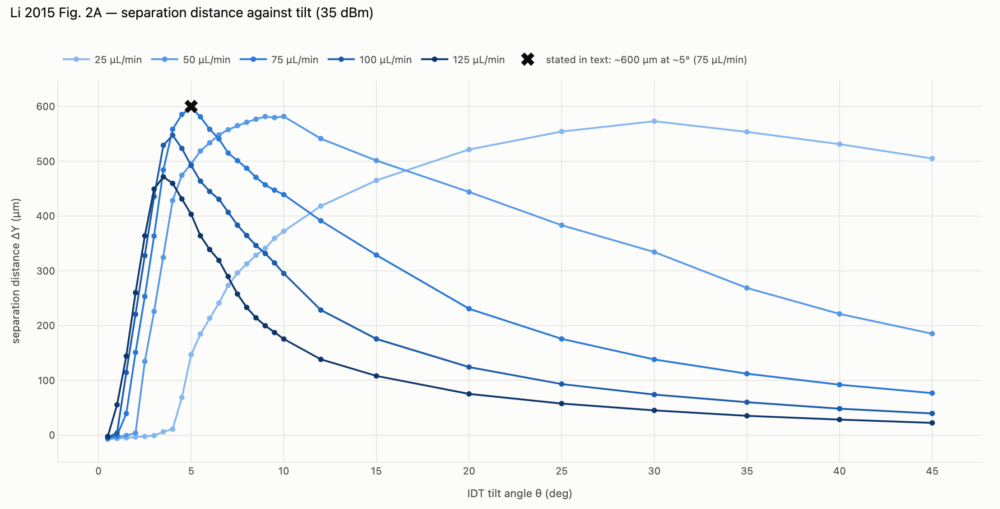

*Fig. 2A analogue: separation distance against tilt at five flow rates* — [interactive](benchmark_01_tassaw/results/figures/fig2a_tilt.html)

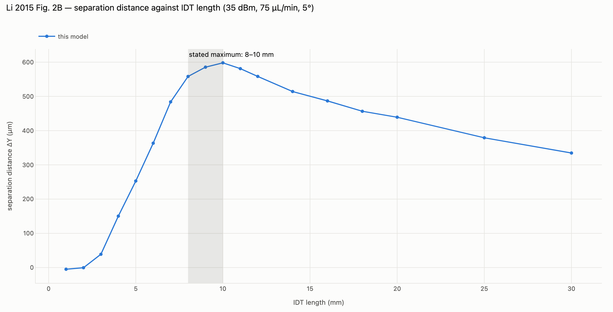

*Fig. 2B analogue: separation distance against IDT length* — [interactive](benchmark_01_tassaw/results/figures/fig2b_idt_length.html)

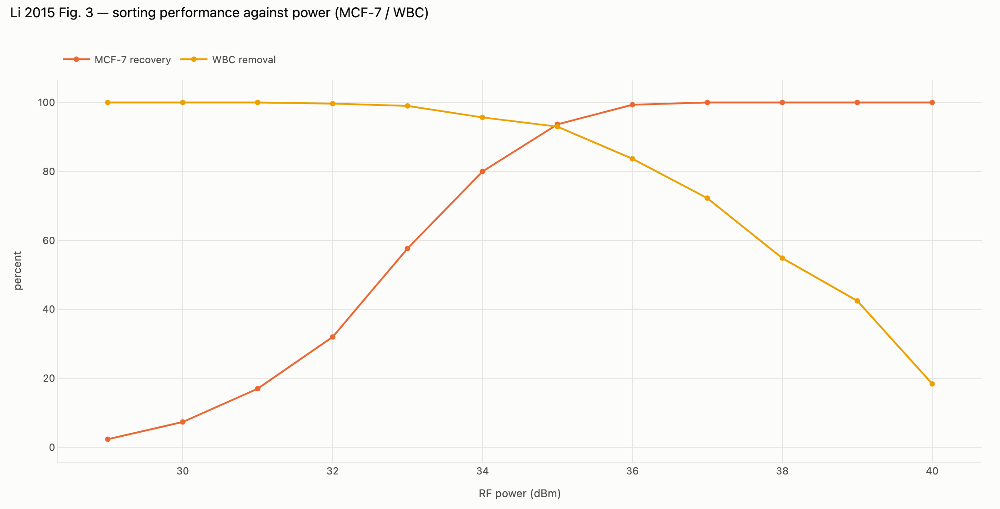

*Fig. 3 analogue: recovery and WBC removal against power* — [interactive](benchmark_01_tassaw/results/figures/fig3_power.html)

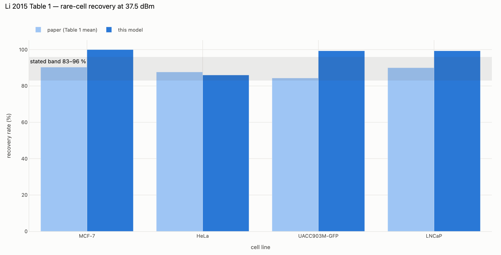

*Table 1: rare-cell recovery at 37.5 dBm* — [interactive](benchmark_01_tassaw/results/figures/table1.html)

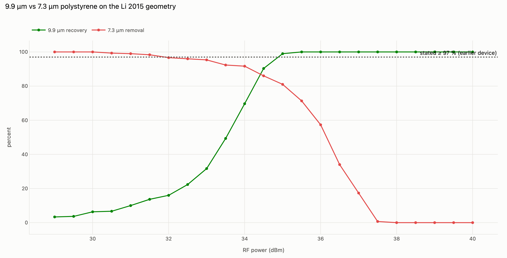

*9.9 vs 7.3 µm polystyrene* — [interactive](benchmark_01_tassaw/results/figures/beads.html)

### Sensitivity — is Table 1 one power offset away?

At the stated ~37.5 dBm the model over-drives: WBC removal falls to
70 % against the stated ~90 %. The same model reaches 90 % WBC removal
at **35.3 dBm**, **2.2 dB** below the stated drive —
the kind of offset an unreported RF insertion loss would produce. At that power:

| Line | Recovery | WBC removal |
|---|---|---|
| MCF-7 | 98.0 % | 93.0 % |
| HeLa | 34.0 % | 92.3 % |
| UACC903M-GFP | 78.3 % | 93.0 % |
| LNCaP | 78.3 % | 93.0 % |

The offset fixes the leukocytes and MCF-7, but not HeLa (34 %), UACC903M-GFP (78 %), LNCaP (78 %). So one offset does **not** reconcile Table 1: the model's size selectivity is sharper than the device's. The paper recovers every line at 83-96 % while removing ~90 % of leukocytes; in the model a line whose (assumed) diameter sits close to the leukocyte tail cannot have both. The inputs that decide this --- per-line diameters (the paper gives only '16 or 20 um'), size spreads and the Table S1 compressibilities --- are exactly the unavailable ones.

This is a sensitivity, not a comparison: it fits a second number.

## benchmark_02 — alternating-frequency BAW (Zhang et al. 2023)

**Paper:** Zhang Y, Zhang Z, Zheng D, Huang T, Fu Q, Liu Y (2023) Label-Free Separation of Circulating Tumor Cells and Clusters by Alternating Frequency Acoustic Field in a Microfluidic Chip. Int J Mol Sci 24(4):3338, doi:[10.3390/ijms24043338](https://doi.org/10.3390/ijms24043338) (open access).
**Mode:** `alternating_baw`. **Config:** [`benchmark_02_alternating_baw/config.yaml`](benchmark_02_alternating_baw/config.yaml).
**Integrator:** fourth-order Runge–Kutta, as in the paper, landing on every switch; checked
against `solve_ivp` and the closed-form trajectory in `tests/test_baw.py`.

### Device

| Parameter | Value | Status |
|---|---|---|
| Channel | 737 µm × 50 µm, silicon + Pyrex, piezoceramic below | stated (Sec. 4.1) |
| Modes | 1 MHz (node W/2), 3 MHz (nodes W/6, W/2, 5W/6) | stated (Sec. 4.2) |
| Drive | 1 MHz 0.8 s / 9 Vpp; 3 MHz 1.4 s / 110 Vpp | stated (Sec. 2.2) |
| Flow | 50 µL/h sample + 100 µL/h sheath → y₀ < W/3 | stated; the band is *derived* from the ratio |
| Outlets | three; the centre third collects | count stated, widths **ASSUMPTION** |
| Acoustic region length | 20 mm | **ASSUMPTION** (swept in case d) |
| Cell sizes | MCF-7 18 µm (library), HCT116 14.8, A549 19.6, PBMC 8 µm | range 14.8–19.6 stated; per-line values **ASSUMPTION** |
| Compressibility | cancer 4.3, PBMC 4.0 ×10⁻¹⁰ Pa⁻¹ | only in Fig. 1 → **ASSUMPTION** |
| E_ac, 1 MHz @ 9 Vpp | **41.06 J/m³** | **CALIBRATED** from the W/6 rule |
| E_ac, 3 MHz @ 110 Vpp | **19.94 J/m³** | **CALIBRATED** from "minimum beyond 1 s" |

**Calibration.** The paper states no energy density. `E_1MHz` is the geometric mean of the
interval the stated design rule allows — a mean MCF-7 must move more than W/6 during the
1 MHz phase (25.2 J/m³ and up) and a mean PBMC less
(up to 66.9 J/m³) — which gives equal factor margin
(1.63×) on both sides. `E_3MHz` returns a mean PBMC from 90 % to
10 % of its node-to-antinode distance in 1.0 s; the fractions are choices, and case (a)'s
"minimum beyond 1 s" is therefore marked calibration-informed.
With these, the rule holds: MCF7: 180 µm, PBMC: 76 µm against W/6 = 123 µm.

### Results — PASS: 15, DEVIATION: 7, REPRODUCED: 4, NOT REPRODUCED: 5, CALIBRATION: 2

| Case | Quantity | Ours | Paper | Deviation | Status |
|---|---|---|---|---|---|
| cal | E_1MHz in config.yaml vs design-rule calibration | 41.1 J/m^3 | 41.1 J/m^3 | — | **CALIBRATION** |
| cal | E_3MHz in config.yaml vs return-time calibration | 19.9 J/m^3 | 19.9 J/m^3 | — | **CALIBRATION** |
| 2a | capture changes little with the 3 MHz duration | 99-100 % over 0.2-3 s | spread <= 10 points | — | **PASS** |
| 2a | contamination falls with the 3 MHz duration | 100.0 -> 12.0 % | decreasing | — | **PASS** |
| 2a | contamination minimum lies beyond T3 = 1 s | min 12.0 % at 3 s; 18.8 % worst beyond 1 s vs 31.0 % best before | minimum at T3 > 1 s | — | **PASS** |
| 2a | contamination is FLAT beyond 1 s (plateau reading) | 18.8 -> 12.0 % over 1.2-3 s | plateau (within 3 points) | — | **NOT REPRODUCED** |
| 2b | both metrics rise with 1 MHz T1 | capture 3->100 %, contamination 3.5->83.2 % | increasing | — | **PASS** |
| 2b | contamination rises much less than capture (up to the best T1) | +93 vs +8.2 points (to 0.7 s) | d(contamination) <= d(capture)/3 | — | **PASS** |
| 2b | a high-capture / low-contamination window in T1 | none (best J = 84 % at 0.7 s: 96 % / 11.8 %) | capture >= 90 %, contamination <= 5 % | — | **NOT REPRODUCED** |
| 2c | both metrics rise with 1 MHz V1 | capture 6->100 %, contamination 5.2->100.0 % | increasing | — | **PASS** |
| 2c | contamination rises much less than capture (up to the best V1) | +93 vs +12.0 points (to 9 Vpp) | d(contamination) <= d(capture)/3 | — | **PASS** |
| 2c | a high-capture / low-contamination window in V1 | none (best J = 82 % at 9 Vpp: 100 % / 17.2 %) | capture >= 90 %, contamination <= 5 % | — | **NOT REPRODUCED** |
| 8b | entering at the end of 3 MHz: complete separation after 2 cycles | MCF7 at midline 100 %, PBMC at midline 17 % | 100 % / 0 % | — | **NOT REPRODUCED** |
| 8 | after 2 cycles most PBMCs sit around the W/6 node | 67 % (entry at 1 MHz start), 83 % (entry at 3 MHz end) | most | — | **REPRODUCED** |
| 8a | entering at the start of 1 MHz: some PBMCs reach the midline | 33 % of PBMCs at midline | a small portion | — | **REPRODUCED** |
| 8 | entry at the start of 1 MHz is the worse case for contamination | 33 % vs 17 % | a > b | — | **PASS** |
| 4 | A549 capture at 150 uL/h | 99.0 % | 94.6 % | +4.4 | **PASS** |
| 4 | PBMC contamination at 150 uL/h | 19.2 % | 1.0 % | +18.2 | **DEVIATION** |
| 4 | A549 capture at 300 uL/h | 99.0 % | 95.8 % | +3.2 | **PASS** |
| 4 | PBMC contamination at 300 uL/h | 19.0 % | 1.0 % | +18.0 | **DEVIATION** |
| 4 | A549 capture at 900 uL/h | 21.0 % | 84.0 % | -63.0 | **DEVIATION** |
| 4 | PBMC contamination at 900 uL/h | 9.5 % | 1.0 % | +8.5 | **DEVIATION** |
| 4 | capture holds from 150 to 300 uL/h, then drops at 900 | 99 -> 99 -> 21 % | flat, then lower | — | **PASS** |
| Table 1 | MCF7 capture | 96.5 % | 95.0 % | +1.5 | **PASS** |
| Table 1 | MCF7 PBMC contamination | 17.2 % | 1.3 % | +15.9 | **DEVIATION** |
| Table 1 | HCT116 capture | 93.5 % | 94.4 % | -0.9 | **PASS** |
| Table 1 | HCT116 PBMC contamination | 31.2 % | 1.7 % | +29.6 | **DEVIATION** |
| Table 1 | A549 capture | 96.0 % | 94.6 % | +1.4 | **PASS** |
| Table 1 | A549 PBMC contamination | 21.2 % | 1.5 % | +19.8 | **DEVIATION** |
| f | design rule: MCF7 moves > W/6, PBMC < W/6 in the 1 MHz phase | MCF7 180 um, PBMC 76 um (W/6 = 123 um) | satisfied | — | **REPRODUCED** |
| CF | size-only separation fails for < 2 um difference | best J 36 % (68 % / 33.0 % at 8 Vpp) | fails | — | **REPRODUCED** |
| CF | adding the measured compressibility difference makes it succeed | best J 1 % (4 % / 2.8 % at 3 Vpp) | succeeds | — | **NOT REPRODUCED** |
| CF | model follows Gor'kov: best J ordered reversed > size-only > measured | 70 > 36 > 1 % | reversed > size-only > measured | — | **PASS** |

- **cal — E_1MHz in config.yaml vs design-rule calibration**: *note:* geometric mean of the W/6-rule interval [25.2, 66.9] J/m^3
- **cal — E_3MHz in config.yaml vs return-time calibration**: *note:* mean PBMC from 90 % to 10 % of node-antinode distance in 1.0 s
- **2a — contamination minimum lies beyond T3 = 1 s**: *note:* calibration-informed: E_3MHz was derived from this statement
- **2a — contamination is FLAT beyond 1 s (plateau reading)**: *note:* the model keeps improving: a longer 3 MHz phase gives more of the PBMCs near the W/3 edge of the stream a full return to W/6 before their first 1 MHz push, and that fraction keeps growing past 1 s
- **8b — entering at the end of 3 MHz: complete separation after 2 cycles**: *note:* a PBMC that enters just below the W/3 antinode in the last 15 % of the 3 MHz phase is not pulled back before the next 1 MHz phase with the calibrated E_3MHz; the paper does not state which y0 it simulated
- **4 — A549 capture at 150 uL/h**: *note:* durations 0.80 s / 1.40 s (x1.00 of stated)
- **4 — PBMC contamination at 150 uL/h**: *likely cause:* PBMCs that start in the upper part of the sample stream, near its W/3 edge, and meet a 1 MHz phase before a full 3 MHz phase has pulled them back to W/6, cross W/3; the paper's 1:2 ratio puts that edge exactly on the 3 MHz antinode, an unstable point. Confining the inlet to y0 < W/6, as the paper says would be ideal, removes most of it (contamination-sensitivity table)
- **4 — A549 capture at 300 uL/h**: *note:* durations 0.80 s / 1.40 s (x1.00 of stated)
- **4 — PBMC contamination at 300 uL/h**: *likely cause:* PBMCs that start in the upper part of the sample stream, near its W/3 edge, and meet a 1 MHz phase before a full 3 MHz phase has pulled them back to W/6, cross W/3; the paper's 1:2 ratio puts that edge exactly on the 3 MHz antinode, an unstable point. Confining the inlet to y0 < W/6, as the paper says would be ideal, removes most of it (contamination-sensitivity table)
- **4 — A549 capture at 900 uL/h**: *note:* durations 0.34 s / 0.59 s (x0.43 of stated) *likely cause:* the acoustic region length and the reduced durations used at 900 uL/h are both unstated; with the least duration cut the two-cycle rule allows, the result depends strongly on the assumed length (see the length sweep)
- **4 — PBMC contamination at 900 uL/h**: *likely cause:* PBMCs that start in the upper part of the sample stream, near its W/3 edge, and meet a 1 MHz phase before a full 3 MHz phase has pulled them back to W/6, cross W/3; the paper's 1:2 ratio puts that edge exactly on the 3 MHz antinode, an unstable point. Confining the inlet to y0 < W/6, as the paper says would be ideal, removes most of it (contamination-sensitivity table)
- **Table 1 — MCF7 capture**: *note:* at the Youden-best 1 MHz amplitude, 9 Vpp
- **Table 1 — MCF7 PBMC contamination**: *note:* at the Youden-best 1 MHz amplitude, 9 Vpp *likely cause:* PBMCs that start in the upper part of the sample stream, near its W/3 edge, and meet a 1 MHz phase before a full 3 MHz phase has pulled them back to W/6, cross W/3; the paper's 1:2 ratio puts that edge exactly on the 3 MHz antinode, an unstable point. Confining the inlet to y0 < W/6, as the paper says would be ideal, removes most of it (contamination-sensitivity table)
- **Table 1 — HCT116 capture**: *note:* at the Youden-best 1 MHz amplitude, 10 Vpp
- **Table 1 — HCT116 PBMC contamination**: *note:* at the Youden-best 1 MHz amplitude, 10 Vpp *likely cause:* PBMCs that start in the upper part of the sample stream, near its W/3 edge, and meet a 1 MHz phase before a full 3 MHz phase has pulled them back to W/6, cross W/3; the paper's 1:2 ratio puts that edge exactly on the 3 MHz antinode, an unstable point. Confining the inlet to y0 < W/6, as the paper says would be ideal, removes most of it (contamination-sensitivity table)
- **Table 1 — A549 capture**: *note:* at the Youden-best 1 MHz amplitude, 9 Vpp
- **Table 1 — A549 PBMC contamination**: *note:* at the Youden-best 1 MHz amplitude, 9 Vpp *likely cause:* PBMCs that start in the upper part of the sample stream, near its W/3 edge, and meet a 1 MHz phase before a full 3 MHz phase has pulled them back to W/6, cross W/3; the paper's 1:2 ratio puts that edge exactly on the 3 MHz antinode, an unstable point. Confining the inlet to y0 < W/6, as the paper says would be ideal, removes most of it (contamination-sensitivity table)
- **f — design rule: MCF7 moves > W/6, PBMC < W/6 in the 1 MHz phase**: *note:* satisfied by construction of E_1MHz; the integrator-level test is tests/test_baw.py::test_design_rule_holds_in_the_integrated_trajectory
- **CF — adding the measured compressibility difference makes it succeed**: *note:* the paper's central claim; see REPORT.md for why the model cannot support it with the Fig. 1 ordering

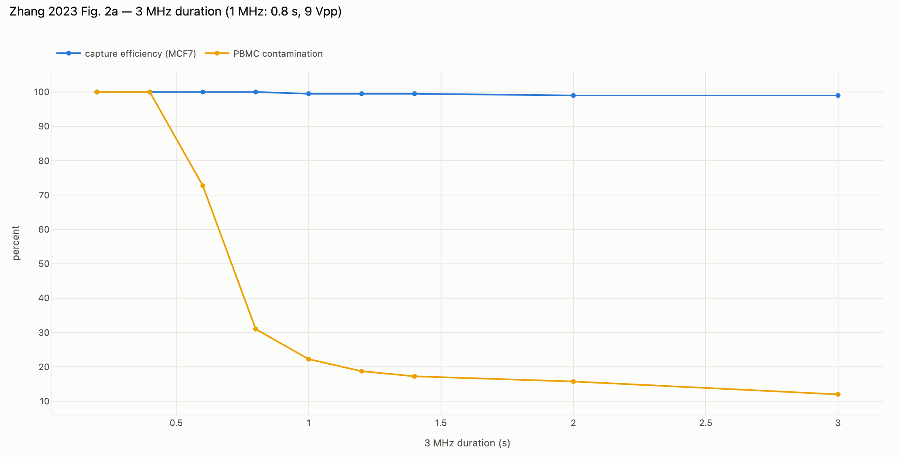

*Fig. 2a analogue: 3 MHz duration* — [interactive](benchmark_02_alternating_baw/results/figures/fig2a_T3.html)

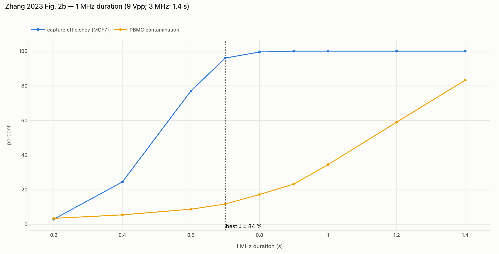

*Fig. 2b analogue: 1 MHz duration, with the Youden-best setting* — [interactive](benchmark_02_alternating_baw/results/figures/fig2b_T1.html)

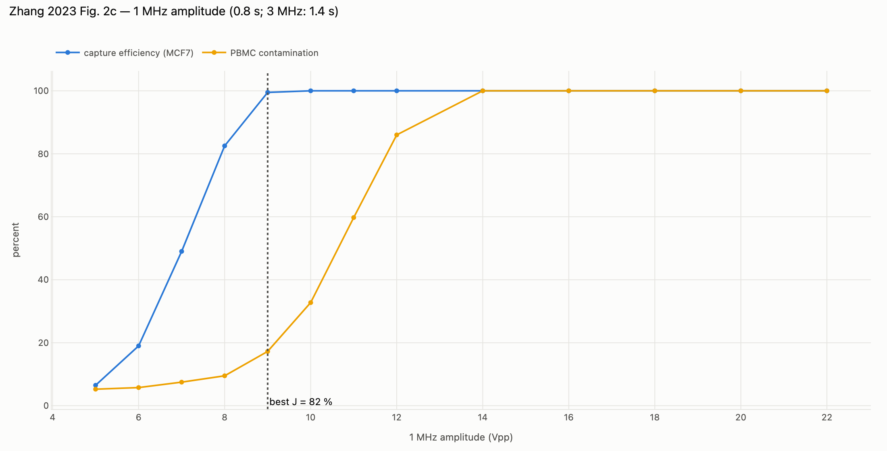

*Fig. 2c analogue: 1 MHz amplitude, with the Youden-best setting* — [interactive](benchmark_02_alternating_baw/results/figures/fig2c_V1.html)

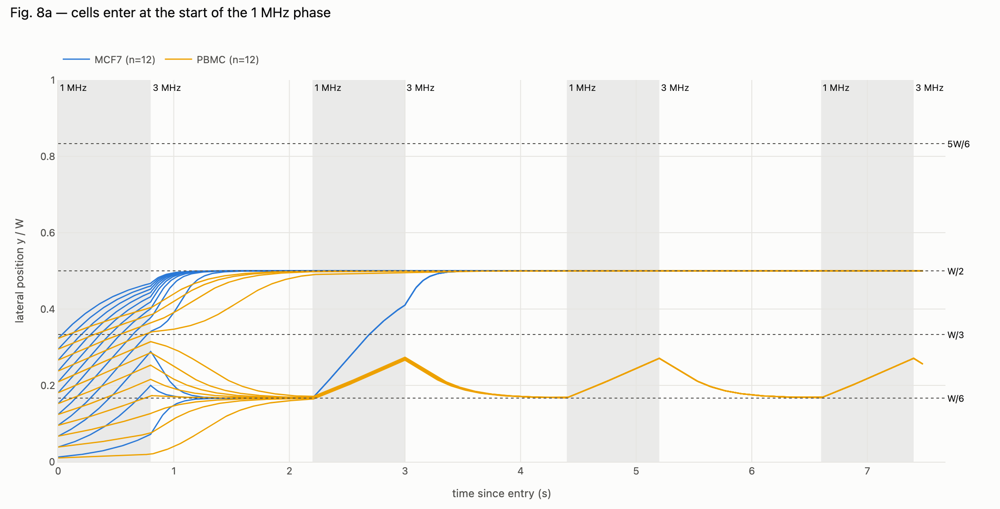

*Fig. 8a analogue: entry at the start of the 1 MHz phase* — [interactive](benchmark_02_alternating_baw/results/figures/fig8a_trajectories.html)

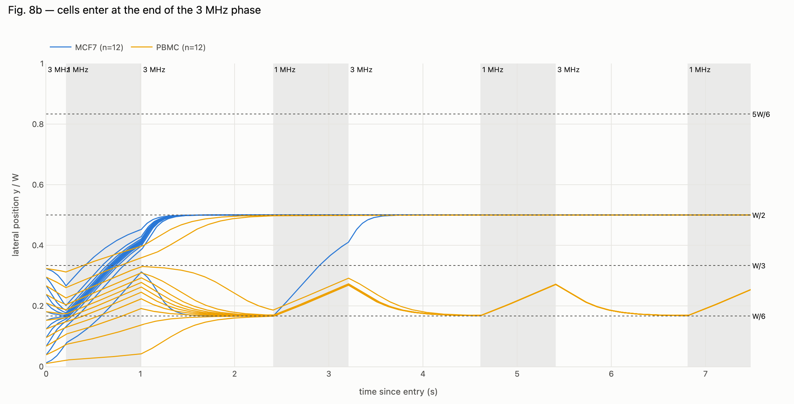

*Fig. 8b analogue: entry at the end of the 3 MHz phase* — [interactive](benchmark_02_alternating_baw/results/figures/fig8b_trajectories.html)

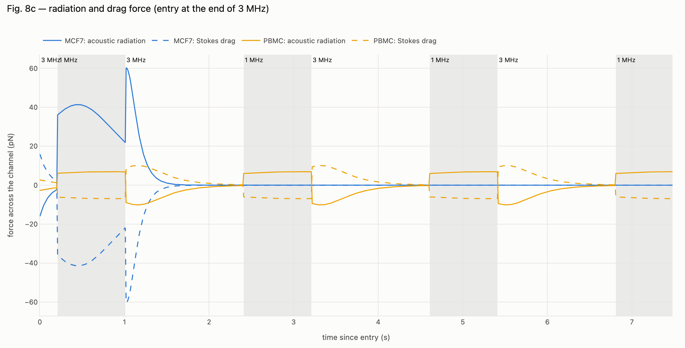

*Fig. 8c analogue: radiation and Stokes drag force, phases shaded* — [interactive](benchmark_02_alternating_baw/results/figures/fig8c_forces.html)

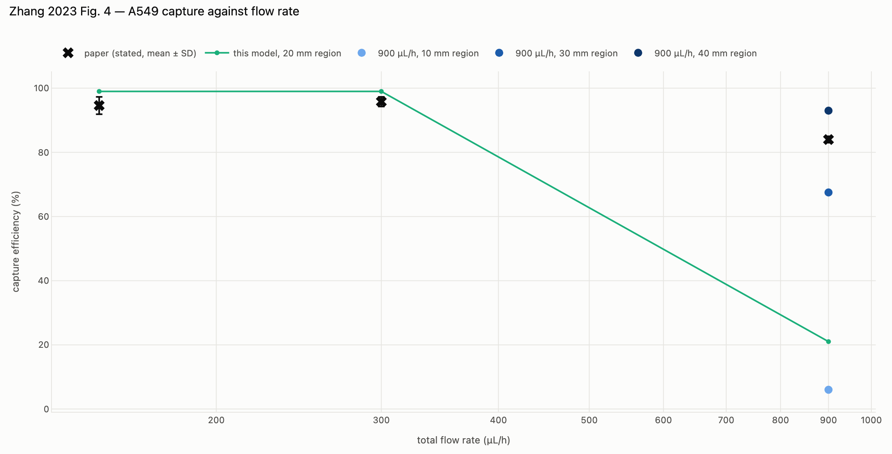

*Fig. 4 analogue: A549 capture against flow rate* — [interactive](benchmark_02_alternating_baw/results/figures/fig4_flow.html)

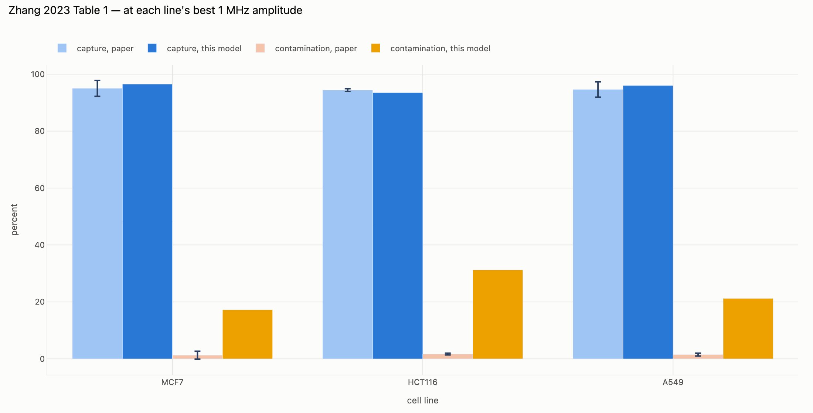

*Table 1 at each line’s best 1 MHz amplitude* — [interactive](benchmark_02_alternating_baw/results/figures/table1.html)

### Why contamination is high: which assumption carries it

Capture matches the paper within a few points everywhere; PBMC contamination does not.
Re-running the baseline with one assumption changed at a time:

| Variant | Capture | Contamination |
|---|---|---|
| baseline (config.yaml) | 99.5 % | 17.2 % |
| inlet band exactly y0 < W/3, as stated | 99.5 % | 19.0 % |
| inlet confined to y0 < W/6 (sheath 5:1) | 99.5 % | 4.8 % |
| every cell enters at the end of 3 MHz | 99.5 % | 30.2 % |
| PBMC size CV 10 % | 99.5 % | 14.0 % |

The inlet row settles it. Contamination comes from PBMCs that start in the upper part of
the sample stream: with a 1:2 ratio the stream's edge sits on the W/3 antinode of the
3 MHz mode, an unstable equilibrium, and a PBMC near it that meets a 1 MHz phase before a
full 3 MHz phase has pulled it back to W/6 is carried over. That is also why making every
cell enter at the *end* of the 3 MHz phase makes it worse here, not better: those cells
get only a fraction of a 3 MHz phase before the next push. Confining the inlet to
y₀ < W/6 — which the paper itself calls the theoretical optimum — removes most of it.
The real device evidently does better than the model at the stream edge; candidates are
hydrodynamic lift holding cells off the sheath interface, a narrower cell-laden band than
the flux share suggests, and a stronger 3 MHz field than the one calibrated here. None
of these is in a 1-D Gor'kov model.

### Flow rate and the unstated acoustic length

Durations at higher flow are the stated ones shortened only as much as the two-cycle rule
requires (the paper says they were reduced, not to what).

| Flow (µL/h) | Region (mm) | T₁ / T₃ (s) | A549 capture | Contamination |
|---|---|---|---|---|
| 150 | 20 | 0.80 / 1.40 | 99.0 % | 19.2 % |
| 300 | 20 | 0.80 / 1.40 | 99.0 % | 19.0 % |
| 900 | 10 | 0.17 / 0.29 | 6.0 % | 7.5 % |
| 900 | 20 | 0.34 / 0.59 | 21.0 % | 9.5 % |
| 900 | 30 | 0.51 / 0.90 | 67.5 % | 11.5 % |
| 900 | 40 | 0.68 / 1.20 | 93.0 % | 13.5 % |

The stated drop to 84 % at 900 µL/h lies between the 30 and 40 mm rows. The flow trend is
reproduced; the 900 µL/h number is a statement about the unknown region length.

### Counterfactual — similar sizes, with and without the compressibility difference

CTC 12 µm against patient PBMC 10.5 µm (< 2 µm apart), equal densities, CV 10 %, best
achievable 1 MHz amplitude per arm. "Separated" = capture ≥ 80 % with contamination ≤ 10 %.

| Arm | Best J | Capture | Contamination | at | Separated |
|---|---|---|---|---|---|
| size only (equal compressibility) | 36 % | 68 % | 33.0 % | 8 Vpp | no |
| size + measured compressibility (CTC more compressible) | 1 % | 4 % | 2.8 % | 3 Vpp | no |
| size + reversed compressibility (CTC less compressible) | 70 % | 83 % | 12.8 % | 7 Vpp | no |

**Finding.** Size alone does not separate these cells, as the paper argues. But adding
the compressibility difference *in the direction their own Fig. 1 shows* — cancer cells
**more** compressible than PBMCs — makes separation **worse**, not better: in Gor'kov
theory a more compressible cell has a smaller monopole coefficient
`f₁ = 1 − κ_p/κ_f`, a smaller contrast factor, and a slower drift to the node. The
reversed arm shows that compressibility *can* rescue similar-sized cells, but only if the
CTCs are the stiffer ones. The paper's central claim ("effective separation was achieved
even when the size of CTCs is similar to that of PBMCs") is therefore **not reproduced**
by primary-radiation-force physics with the paper's own compressibility ordering. Density
differences (not measured there), acoustic streaming, or a different meaning of the
measured "compressibility" would have to account for it.

## What these benchmarks can and cannot say

* Both models are **2-D/1-D reduced**: a cross-section force law, analytic Poiseuille
  advection, no acoustic streaming, no inertial lift, no particle–particle interaction.
  Streaming and full piezoelectric fields are the job of the Stage 4 back-ends
  (`solvers/solver_openfoam`, `solvers/solver_elmer`).
* Every unstated input is listed as ASSUMPTION in the device tables and in the material
  library (`biosim materials`); the calibrated ones are listed as CALIBRATED with the rule
  they come from.
* Agreement on a trend is evidence the mechanism is right; agreement on a number after
  calibration is weaker evidence than it looks, and is labelled accordingly.

## References

* Li P, Mao Z, Peng Z, et al. (2015) Acoustic separation of circulating tumor cells.
  *PNAS* 112(16):4970–4975. doi:[10.1073/pnas.1504484112](https://doi.org/10.1073/pnas.1504484112)
* Zhang Y, Zhang Z, Zheng D, Huang T, Fu Q, Liu Y (2023) Label-free separation of
  circulating tumor cells and clusters by alternating frequency acoustic field in a
  microfluidic chip. *Int J Mol Sci* 24(4):3338.
  doi:[10.3390/ijms24043338](https://doi.org/10.3390/ijms24043338)
* Bruus H (2012) Acoustofluidics 7. *Lab Chip* 12:1014. doi:[10.1039/c2lc21068a](https://doi.org/10.1039/c2lc21068a)
* Barnkob R, Augustsson P, Laurell T, Bruus H (2010) Measuring the local pressure amplitude
  in microchannel acoustophoresis. *Lab Chip* 10:563. doi:[10.1039/b920376a](https://doi.org/10.1039/b920376a)
* Ding X, Peng Z, Lin S-CS, et al. (2014) Cell separation using tilted-angle standing
  surface acoustic waves. *PNAS* 111:12992. doi:[10.1073/pnas.1413325111](https://doi.org/10.1073/pnas.1413325111)
